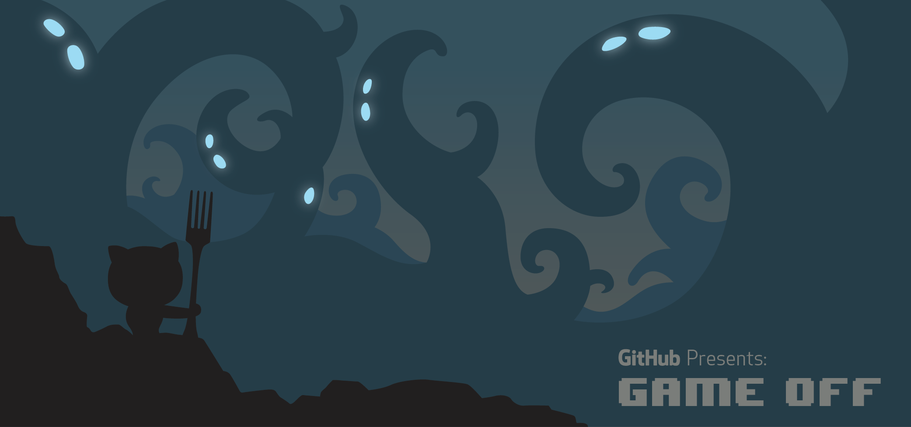

# Hi there! 👋 I'm Bhushan Sonawane 😎

Welcome to my GitHub profile! I'm a passionate developer always learning new things and building cool projects. Here's what I bring to the table:

---

## 🚀 Skills & Tech Stack:
| **Programming Languages** | **Frameworks & Libraries** | **Tools & Platforms** | 
| ------------------------- | ------------------------- | --------------------- | 
|   |   |   |
|   |  |   |

## 📊 GitHub Stats:

  

---

## 🏆 GitHub Trophies:

---

## 🔗 Connect with Me:
)

---
